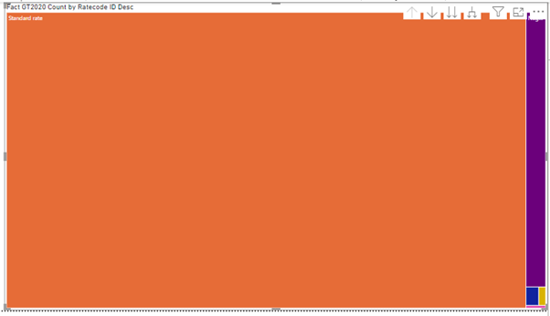
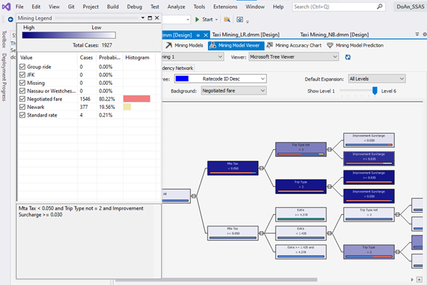

# OLAP

## Source folder:
[2020 Green Taxi link dataset](https://data.cityofnewyork.us/Transportation/2020-Green-Taxi-Trip-Data/pkmi-4kfn)

[taxi look up = location decode](https://s3.amazonaws.com/nyc-tlc/misc/taxi+_zone_lookup.csv)

[desc_csv = other catergorical column decode](https://www1.nyc.gov/assets/tlc/downloads/pdf/data_dictionary_trip_records_green.pdf)

## [diagram](https://app.diagrams.net/#G1R1o1Ah1DGpqyNO_dr-2v0Tc8gcPXZXVA):

## SSIS:
- ATTENTION: I don't use the same name for fact table in ssis and ssas so be careful.

### Preprocessing:
- Detect Null:  ISNULL(VendorID) || ISNULL(RatecodeID) || ISNULL(trip_type) || ISNULL(payment_type) || ISNULL(congestion_surcharge) || ISNULL(store_and_fwd_flag) || ISNULL(passenger_count)
- Detect outlier on mta_tax: mta_tax == 3.55
- detect outlier on passenger_count: passenger == 0
- detect outlier on RateCodeID: RateCodeID==99.0
- detect on Pickup_Dropoff_date: YEAR(lpep_pickup_datetime) > 2021 || YEAR(lpep_dropoff_datetime) > 2021
- detect negative values: : SIGN(trip_distance) == -1 || SIGN(fare_amount) == -1 || SIGN(extra) == -1 || SIGN(mta_tax) == -1 || SIGN(tip_amount) == -1 || SIGN(tolls_amount) == -1 || SIGN(improvement_surcharge) == -1 || SIGN(total_amount) == -1 || SIGN(congestion_surcharge) == -1
- create table: [RecordID]  int IDENTITY(1,1) not null primary key ....

  

### Dim PU/DOLocation:

### Dim Pickup/Dropoff Date:

### Other dim:
- Condition split: check is null or not

### Fact:
- using Lookup

- create fk using Execute SQL Task:

alter table Fact_RecordTaxi
add constraint FK_fact_DOlocation
foreign key (DOLocationID) references Dim_DOLocation(DOLocationID);

alter table Fact_RecordTaxi
add constraint FK_fact_PUlocation
foreign key (PULocationID) references Dim_PULocation(PULocationID);

alter table Fact_RecordTaxi
add constraint FK_fact_pickupdate
foreign key (lpep_pickup_datetime) references Dim_Pickup_Date(lpep_pickup_datetime);

alter table Fact_RecordTaxi
add constraint FK_fact_dropoffdate
foreign key (lpep_dropoff_datetime) references Dim_Dropoff_Date(lpep_dropoff_datetime);

alter table Fact_RecordTaxi
add constraint FK_fact_vendor
foreign key (VendorID) references Dim_Vendor(VendorID);

alter table Fact_RecordTaxi
add constraint FK_fact_flag
foreign key (store_and_fwd_flag) references Dim_flag(store_and_fwd_flag);

alter table Fact_RecordTaxi
add constraint FK_fact_ratecode
foreign key (RatecodeID) references Dim_Ratecode(RatecodeID);

alter table Fact_RecordTaxi
add constraint FK_fact_payment
foreign key (payment_type) references Dim_Payment(payment_type);

alter table Fact_RecordTaxi
add constraint FK_fact_triptype
foreign key (trip_type) references Dim_Triptype(trip_type);

- FK in database:

  

## SSAS:
### Hierarchy for Pickup/Dropoff Date:

### Hierarchy for PU/DOLocation:

### 15 query using MDX:
#### 1: Top 3 dropoff service zones have the most sum of tip_amount in each year:

select 
	non empty  [Measures].[Tip Amount] on 0,
	non empty generate(
		[Dim Dropoff Date].[Dropoff Year].children,
		topcount(
		{[Dim Dropoff Date].[Dropoff Year].currentmember*[Dim DO Location].[DO Service Zone].children}
		,3,[Measures].[Tip Amount])) on 1 
from [GT2020];

#### 2: Top 3 dropoff Zones have the most sum of tip amount in each Borough:
  select [Measures].[Tip Amount] on 0,
non empty generate(
[Dim DO Location].[DO Borough].children,
topcount({[Dim DO Location].[DO Borough].currentmember*[Dim DO Location].[DO Zone].children},3,[Measures].[Tip Amount])
) on 1
from [GT2020];

#### 3: Count pick up taxi trip in each year, month
 select non empty [Measures].[Fact GT2020 Count] on 0,non empty
 ([Dim Pickup Date].[Pickup Month].children,[Dim Pickup Date].[Pickup Year].children) on 1
 from [GT2020];

 select non empty [Measures].[Fact GT2020 Count] on 0, non empty
  [Dim Pickup Date].[Pickup Year].children on 1 from [GT2020];

#### 4: List the pick up service_zones have tip more than 10000

select  [Measures].[Tip Amount] on 0,{[Dim PU Location].[PU Service Zone].[PU Service Zone].members}
having [Measures].[Tip Amount] > 10000 on 1
from [GT2020];

#### 5: Top 3 the most choice of RateCode in each pick up years
select [Measures].[Fact GT2020 Count] on 0,
non empty generate(
[Dim Pickup Date].[Pickup Year].children,
topcount({[Dim Pickup Date].[Pickup Year].currentmember*[Dim Rate Code].[Ratecode ID Desc].children},3,[Measures].[Fact GT2020 Count])
) on 1
from [GT2020];

#### 6:Show the total amount ascending order after subtraction of all fees including mta_tax, fare amount, tolls amount, congestion surcharge, extra, and improvement surcharge in each drop-off month in 2020 while the drop-off service zone is Airport

with member [Measures].[Profit]
as '([Measures].[Total Amount] - [Measures].[Extra]-[Measures].[Congestion Surcharge]-[Measures].[Fare Amount]-[Measures].[Improvement Surcharge]
- [Measures].[Mta Tax] - [Measures].[Tolls Amount])'
select [Measures].[Profit] on 0, order([Dim Dropoff Date].[Hierarchy].[Dropoff Month],[Measures].[Profit],asc) on 1
From [GT2020]
Where ([Dim DO Location].[DO Service Zone].&[Airports], [Dim Dropoff Date].[Dropoff Year].&[2020]);

#### 7: Show average passenger count in each month of 4th quarter year 2020
with member [Measures].[Avg passenger count] as 
'[Measures].[Passenger Count]/[Measures].[Fact GT2020 Count]'

select 
	[Measures].[Avg passenger count] on 1, 
	[Dim Pickup Date].[Pickup Month].children on 0
From [GT2020]
where [Pickup Quarter].&[4]&[2020];

#### 8:trip distance in each drop off zone, borough
select non empty 
	[Measures].[Trip Distance] on 0,
	non empty ([Dim DO Location].[DO Borough].children,[Dim DO Location].[DO Zone].children) on 1 
From [GT2020];

select 
	non empty [Measures].[Trip Distance] on 0,
	non empty [Dim DO Location].[DO Borough].children on 1 
From [GT2020];

#### 9:the  10 pick up zones give the lowest tip amount 
select 
 non empty [Measures].[Tip Amount] on 0,
 non empty 
	bottomcount ([Dim PU Location].[Hierarchy].[PU Zone].members,10,[Measures].[Tip Amount]) on 1
from [GT2020];

#### 10: Except N/A, show service zones have the most pick up

select 
	topcount(
		except ([Dim PU Location].[Hierarchy].[PU Service Zone],[Dim PU Location].[Hierarchy].[PU Service Zone].&["N/A"])
			,1,[Measures].[Fact GT2020 Count])on  1,
	non empty [Measures].[Fact GT2020 Count] on 0
from [GT2020];

#### 11:   Show percentage of tip amount when pick up in  Jan, Ferb, May, June, July, Sep, Oct, Nov, Dec in each quarter of 2020
with member [Measures].[PercentTip] as [Measures].[Tip Amount]/[Measures].[Total Amount] *100

select non empty 
	except(
	 {DRILLDOWNLEVEL(
		DRILLDOWNLEVEL(
		[Dim Pickup Date].[Hierarchy].[Pickup Year].&[2020])
		)
},{[Dim Pickup Date].[Hierarchy].[Pickup Month].&[3]&[1]&[2020],
	[Dim Pickup Date].[Hierarchy].[Pickup Month].&[4]&[2]&[2020],
	[Dim Pickup Date].[Hierarchy].[Pickup Month].&[8]&[3]&[2020]}) ON 1,

[Measures].[PercentTip] on 0
from [GT2020];

#### 12:Avg trip distance when pick up in 2020
with member [Measures].[AvgTrip] as [Measures].[Trip Distance]/[Measures].[Fact GT2020 Count]

select 
	non empty [Measures].[AvgTrip] on 1,
	non empty [Dim Pickup Date].[Pickup Year].&[2020] on 0
From [GT2020];

#### 13:Pick up zones have to pay mtx tax more than 10000 in 2020

select  
	non empty [Measures].[Mta Tax] on 0,
	non empty [Dim PU Location].[PU Zone].children having [Measures].[Mta Tax] > 10000 on 1
from [GT2020]
where [Dim Pickup Date].[Pickup Year].&[2020];

#### 14:Pick up service zone have the most passenger in 2020

select 
	non empty 
	topcount([Dim PU Location].[Hierarchy].[PU Service Zone],1,[Measures].[Passenger Count]) 
			having [Dim Pickup Date].[Pickup Year].&[2020] on 0
from [GT2020];

#### 15: RateCode have the most used in December 2020 when drop off
select 
	non empty [Dim Dropoff Date].[Dropoff Month].&[12]&[4]&[2020] on 1,
	topcount([Dim Rate Code].[Ratecode ID Desc].children,1,[Measures].[Fact GT2020 Count]) on 0
from [GT2020];

## PowerBI:

### Pick up zones have to pay mtx tax more than 10000 in 2020:

### the  10 pick up zones give the lowest tip amount:

### trip distance in each drop off zone, borough:

### Top 3 the most choice of RateCode in each pick up years:

### RateCode have the most used in December 2020 when drop off:

## Data Mining:
- Microsoft Decision tree
  ### Create data for DM:

  

  ### Set up input/output

  

  ### Result:
  - All rule:
 
    
    
  - Mta Tax < 0.050 and Trip Type not = 2 and Improvement Surcharge >= 0.030

  - Mta Tax < 0.050 and Trip Type = 2
 

  - Mta >= 0.05 và Mta Tax < 0.050 and Trip Type not = 2 and Improvement Surcharge < 0.030
    
